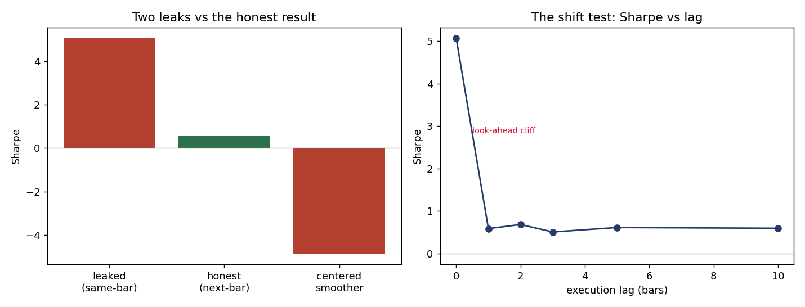

# Project 9 — Look-Ahead Bias Audit ("how a backtest lies")

**Skill demonstrated:** the bias-hunting instinct reviewers prize most — finding and quantifying the subtle leaks that make a worthless rule look brilliant, and the diagnostic that catches them (the **shift test**). **Data:** Binance BTC daily. **Reproduce:** `python run.py`.

## The two leaks

1. **Same-bar execution:** building a signal from bar *t*'s close and then *trading at that same close* — executing at a price you could not have known until the bar was over.
2. **Future-peeking smoother:** a *centered* moving average, which averages bars on *both sides* of the current point and therefore sees the future.

## Results (real, from `run.py`)

| Configuration | Sharpe | Reading |
|---|---|---|
| Breakout rule, **same-bar (leaked)** execution | **+5.07** | looks like a world-beating strategy |
| Same rule, **honest next-bar** execution | **+0.59** | the real, tradeable edge |
| **Phantom alpha from the leak** | **+4.48** | ~88% of the "performance" was look-ahead |
| Same rule with a **centered (future-peeking) smoother** | **−4.86** | manufactures \|4.9\| of fictitious Sharpe |

**The shift test** (Sharpe vs execution lag): `lag0 +5.07 → lag1 +0.59 → lag2 +0.69 → … → lag10 +0.60`.

## Verdict — always run the shift test

A breakout rule that reports **Sharpe 5.07** collapses to **0.59** the moment it is executed on the *next* bar instead of the one it was built from — **88% of the apparent alpha was look-ahead**, not edge. A centered smoother manufactures a Sharpe of magnitude ~5 out of thin air. The diagnostic is simple and decisive: **lag the signal one more bar (the shift test); a real edge barely moves, a leaked one falls off a cliff.** Here the cliff sits entirely between lag 0 and lag 1, and beyond lag 1 the honest Sharpe is flat (~0.6) — so there is no genuine multi-day edge, only the leak.

This is why look-ahead control is built into my backtest engine (Project 8 decides on *t*, earns on *t+1* by construction) and why every candidate gets a shift test. *Related biases a full audit also covers — survivorship (use point-in-time constituents + delisting returns) and revised-vs-point-in-time data (ALFRED, not revised FRED) — routinely erase a similar fraction of apparent alpha.*
